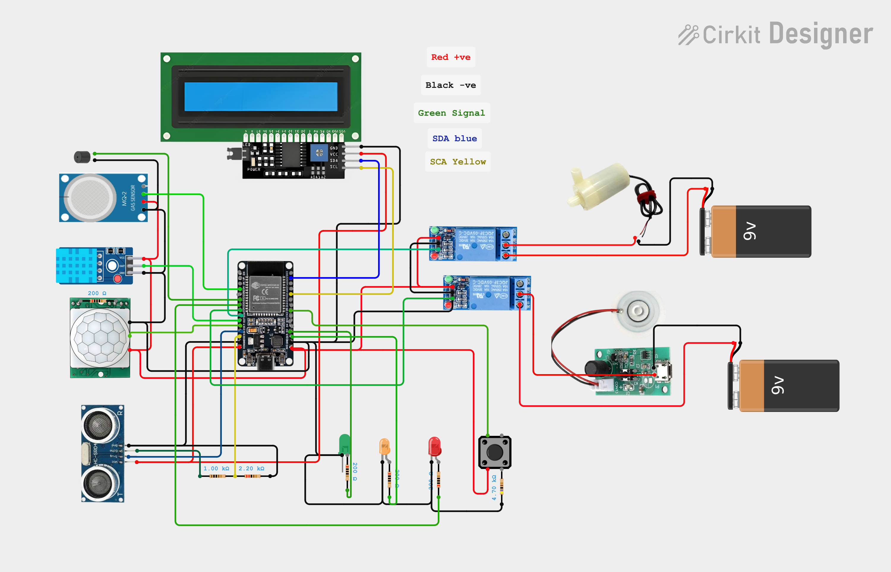

# 🚽 Smart Toilet Monitoring System with Telegram Integration [](https://github.com/sponsors/santhoshh-maax)

An IoT-based Smart Toilet Monitoring System built using **ESP32** that monitors toilet occupancy, air quality, humidity, water level, and environmental conditions. The system automatically controls connected devices and sends real-time notifications to a Telegram bot for remote monitoring.


---

## 📖 Project Overview

This project aims to improve public restroom management using IoT technology. Multiple sensors continuously monitor the toilet environment while the ESP32 processes sensor data and sends instant updates to Telegram.

The system can automatically:

- Detect human presence
- Monitor gas concentration
- Monitor humidity and temperature
- Detect water level
- Control humidifier
- Control water pump
- Display information on LCD
- Send Telegram notifications

---

# 📷 Circuit Diagram

The complete hardware wiring is shown below.

<p align="center">
  
</p>

---

# 🖥 System Architecture

```
                    WiFi
                     │
                     │
              Telegram Bot
                     ▲
                     │
                 Internet
                     ▲
                     │
                 ESP32 Controller
                     │
     ┌───────────────┼─────────────────┐
     │               │                 │
     │               │                 │
 Motion          Environment      Output Devices
 Sensors            Sensors
     │               │                 │
 PIR            MQ-2 Gas Sensor     LCD Display
 Ultrasonic     DHT11               LEDs
 Button         Water Sensor        Buzzer
                                  Relay Module
                                  Water Pump
                                  Humidifier
```

---

# 🔌 Hardware Components

| Component | Quantity |
|------------|----------|
| ESP32 Development Board | 1 |
| LCD 16x2 with I2C | 1 |
| HC-SR04 Ultrasonic Sensor | 1 |
| PIR Motion Sensor | 1 |
| MQ-2 Gas Sensor | 1 |
| DHT11 Temperature Sensor | 1 |
| 5V Relay Module | 2 |
| Mini Water Pump | 1 |
| Humidifier Module | 1 |
| LEDs | 3 |
| Push Button | 1 |
| Buzzer | 1 |
| 9V Battery | 2 |
| Jumper Wires | As Required |

---

# ⚙ Sensor Description

## PIR Motion Sensor

Detects human movement inside the toilet.

---

## Ultrasonic Sensor

Measures the distance to determine occupancy or water level depending on placement.

---

## MQ-2 Gas Sensor

Detects harmful gases and bad odor levels.

---

## DHT11 Sensor

Measures:

- Temperature
- Humidity

---

## LCD Display

Displays

- Toilet Status
- Temperature
- Humidity
- Gas Status
- Water Level
- WiFi Status

---

## Relay Modules

Relay 1

- Controls Water Pump

Relay 2

- Controls Humidifier

---

## LEDs

Green LED

- System Ready

Orange LED

- Warning

Red LED

- Alert Condition

---

## Buzzer

Provides audible alert during emergency conditions.

---

# 📂 Repository Structure

```
Smart-Toilet-Monitoring-System/
│
├── Smart_toilet_without_telegram/
│
├── With_telegram/
│
├── TEST_CODES/
│
├── check_bot/
│
├── final_gemini/
│
├── owntry/
│
├── circuit.png
│
├── PIR-Motion-Sensor.jpg
│
├── mini project.pdf
│
├── mini project.docx
│
├── print out.pdf
│
├── print out.docx
│
└── README.md
```

---

# 🚀 Features

✅ Human Detection

✅ Toilet Occupancy Monitoring

✅ Gas Leakage Detection

✅ Temperature Monitoring

✅ Humidity Monitoring

✅ LCD Status Display

✅ Telegram Notification

✅ Automatic Humidifier Control

✅ Automatic Water Pump Control

✅ WiFi Connectivity

✅ Real-Time Monitoring

---

# 📡 Telegram Notification Examples

```
🚽 Toilet Occupied

🌡 Temperature : 29°C

💧 Humidity : 72%

💨 Gas Level High

⚠ Cleaning Required

💦 Water Pump Activated

🌫 Humidifier ON

✅ System Running Normally
```

---

# 💻 Software Used

- Arduino IDE
- ESP32 Board Package
- UniversalTelegramBot Library
- ArduinoJson
- WiFi Library
- C++ (Arduino)

---

# 📚 Libraries

Install these libraries before uploading the code.

```
WiFi

WiFiClientSecure

UniversalTelegramBot

ArduinoJson

LiquidCrystal_I2C

DHT Sensor Library
```

---

# 🚀 Installation

### 1 Clone Repository

```bash
git clone https://github.com/yourusername/Smart-Toilet-Monitoring-System.git
```

---

### 2 Open Arduino IDE

Open

```
With_telegram.ino
```

or

```
Smart_toilet_without_telegram.ino
```

---

### 3 Configure WiFi

```cpp
const char* ssid = "YOUR_WIFI";
const char* password = "YOUR_PASSWORD";
```

---

### 4 Configure Telegram Bot

```cpp
#define BOT_TOKEN "YOUR_BOT_TOKEN"

#define CHAT_ID "YOUR_CHAT_ID"
```

---

### 5 Upload Code

Select

```
ESP32 Dev Module
```

and upload.

---

# 📄 Documentation

Included in this repository:

- 📘 Mini Project Report
- 📄 Project Documentation
- 🔌 Circuit Diagram
- 📷 Sensor Diagram
- 💻 Source Code
- 🧪 Testing Codes

---

# 🔮 Future Scope

- Mobile Application
- Firebase Integration
- Cloud Dashboard
- AI-based Cleaning Prediction
- Water Usage Analytics
- Multi-Toilet Monitoring
- QR Code Access
- Voice Notification
- OTA Firmware Updates

---

# 👨‍💻 Author

**Santhosh P**

B.E. Computer Science and Engineering

Mount Zion College of Engineering and Technology

GitHub: https://github.com/santhoshh-maax

👉 **[Sponsor me on GitHub](https://github.com/sponsors/santhoshh-maax)**

---

# ⭐ Star the Repository

If you found this project useful, please consider giving it a ⭐ on GitHub.

---

# 📜 License

This project is developed for educational and research purposes.
